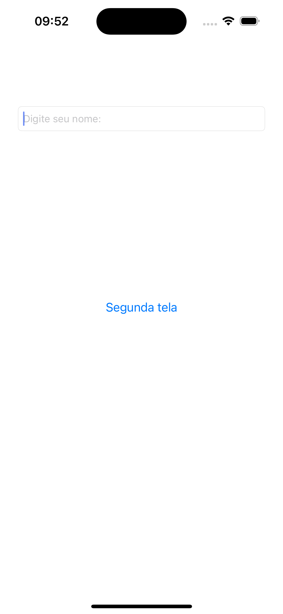
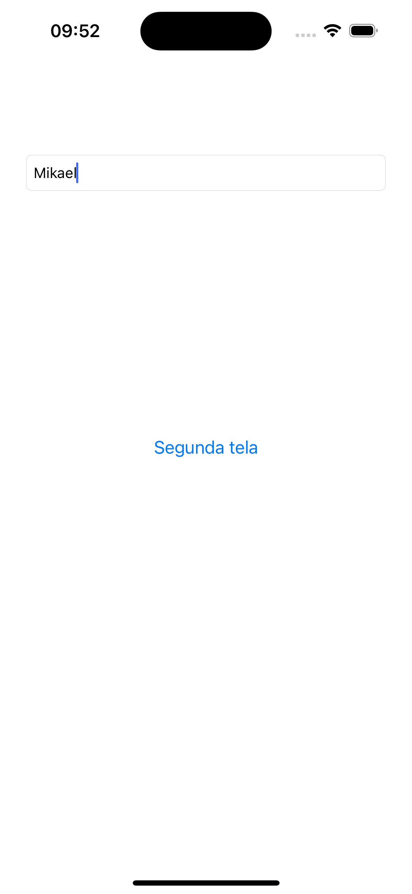
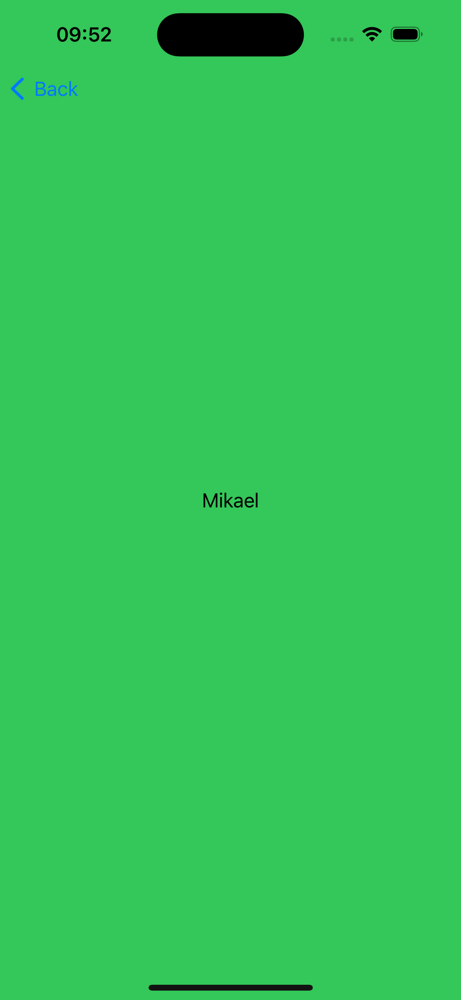

# 🚀 Navegação Avançada no iOS  

Este projeto demonstra **diferentes abordagens de navegação** em aplicativos iOS usando **UIKit e Storyboard**, incluindo:  
✅ Navegação via **Navigation Controller**  
✅ Apresentação de telas via **Modal**  
✅ Passagem de parâmetros entre ViewControllers  

---

## 🎯 **Objetivo do Projeto**  
O principal objetivo deste projeto é ensinar e demonstrar boas práticas de navegação entre telas no iOS, abordando **formas eficientes de transitar dados entre ViewControllers**.  

---

## 📌 **Tecnologias Utilizadas**  
- Swift  
- UIKit  
- Storyboard  
- Xcode  

---

## 📸 Demonstração  

| Tela 1 | Tela 2 | Tela 3 | 
|--------|--------|--------|
|  |  |  | 


### **1️⃣ Clone o Repositório**  
```bash
git clone https://github.com/Mikaelmendonca/Swift-Navegacao-Avancada.git
